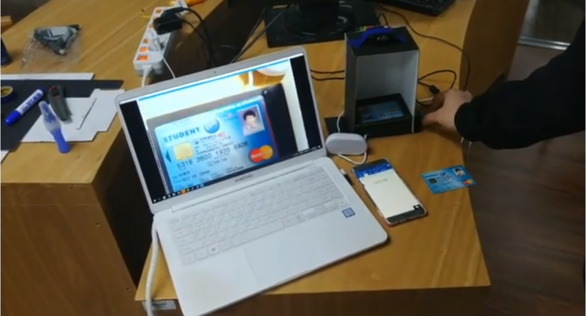

# 과 자치비 납부 여부 확인 기기
* [동영상 링크](https://www.youtube.com/watch?v=2qZ2QpE17s0 "유튜브")  
* 학생증 인식하는 코드 python-docs-samples-master/vision/cloud-client/document_text/doctext.py  
* 교내 코딩 소모임에서 자체적으로 진행한 해커톤 대회에서 창의성을 발휘하여 사람들이 발견하지 못한 불편사항을 찾아 해결하고, 업무 처리효율성을 높인 경험이 있습니다. 매번 과 행사 때마다 과 자치비 납부 여부 확인은 5명 이상의 인원이 엑셀 파일을 통해 일일이 확인해야 하는번거로움이 존재했습니다. 이 방식은 10년 이상 지속 되어왔기 때문에 해결할 수 없는 당연한 문제로 여겨지고 있었습니다. 하지만 저는 확인시간을 줄이면 담당 인력들을 다른 곳에 배치할 수 있어 효율적인 행사 진행이 가능할 것 같았고, 기존에 있던 학생증 촬영을 통해 납부 여부를확인할 수 있는 아이템을 제작하기 시작했습니다.  
* 사전에 기존 엑셀에 저장되어 있던 과 자치비 납부 여부 데이터를 리눅스 서버 DB에 저장하고, 웹에 학번과 납부 여부를 올렸습니다. 그리고HTTP 프로토콜 Method 중 Get 방식을 이용하여 확인하고 싶은 학번을 포함하여 서버에게 요청하고 해당 학번의 자치비 납부 여부만을 전달받아 확인하였습니다.  
* 학생증을 촬영한 뒤, 학번만 추출하는 과정은 다음과 같습니다. 먼저 학교 학생들의 학번은 총 8자리로 구성되어 있고, 맨 앞 두 자리 숫자는과 고유번호로 이루어진 것을 확인했습니다. 그리고 라즈베리파이에 토글 버튼을 연결하여 버튼을 누를 때마다 웹캠이 사진 촬영하도록 구성하였습니다. 촬영한 사진에서 Google Vision API의 OCR 기술을 이용하고 변형하여 8자리 숫자를 찾았습니다. 그러고 나서 저희 과 학생의 학번만 추출하는 것이 목적이기 때문에 앞 두 자리 숫자가 "12" 인 숫자만 판별하도록 하였습니다. 이러한 조건을 모두 만족하는 숫자를 찾았다면 해당 숫자를 변수에 저장하고 웹 URL에 포함해 서버에게 요청하였고, 서버에서는 추출한 학번과 DB에 저장된 데이터를 비교하고 납부 여부를 참, 거짓 두 가지 형태로 판단하여 클라이언트에 결과를 전송했습니다. 결과에 따라 LED와 스피커 음성으로 납부 여부를 출력해 편의성을 증폭시켰습니다.  
* 현재 제작한 아이템은 과 행사 때마다 실제로 사용되고 있습니다. 이는 소요되는 확인시간을 60% 이상 단축하게 하여 효율적인 행사 진행이가능케 했습니다. 또한, 사용자에게서도 좋은 반응을 얻을 수 있었습니다.  
  
  

### 2019 코딩 소모임 '인트아이' 자체 해커톤

           인하대학교 정보통신공학과 박광석  
           인하대학교 정보통신공학과 최유진  
           인하대학교 정보통신공학과 임현호  
           인하대학교 정보통신공학과 최진우  
